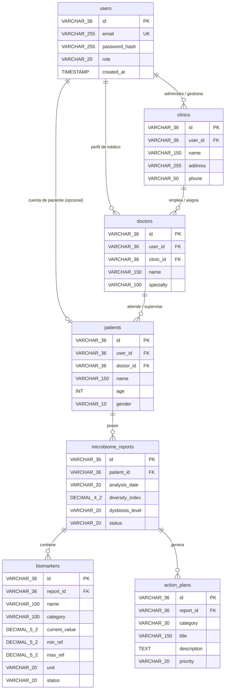

<h1 align="center">🧬 Gestor de Informes Clínicos — Plataforma Full‑Stack</h1>
<p align="center">
  <b>Next.js 16 · TypeScript · Tailwind CSS · shadcn/ui · Kotlin · Spring Boot</b>
</p>

---

## 📘 Descripción General

El **Gestor de Informes Clínicos** es una plataforma full‑stack diseñada para visualizar, analizar y generar informes clínicos accionables a partir de datos biomédicos.  
Está pensada para profesionales de la salud que necesitan identificar rápidamente:

- Alteraciones relevantes en biomarcadores  
- Índices de salud global  
- Recomendaciones de intervención  
- Evolución del paciente a lo largo del tiempo  

La plataforma está diseñada para ser **modular y extensible**, permitiendo integrar distintos tipos de análisis clínicos:  
microbiota, genética, metabolómica, hematología, paneles funcionales, etc.

Este repositorio contiene **dos proyectos independientes**:

- **frontend/** → Dashboard clínico en Next.js 16  
- **backend/** → API REST en Kotlin + Spring Boot  

---

## 📂 Estructura del Repositorio

```bash
gestor-informes-clinicos/
│
├── frontend/        # Dashboard clínico (Next.js 16)
│   └── README.md
│
├── backend/         # API REST (Kotlin + Spring Boot)
│   └── README.md
│
└── README.md        # Este archivo (documentación global)
```


Cada módulo tiene su propio README con instrucciones específicas.

---

## 🧱 Tecnologías

### **Frontend**
- Next.js 16 (App Router)
- TypeScript (strict)
- Tailwind CSS
- shadcn/ui
- Cliente HTTP centralizado (`lib/api.ts`)
- Componentes clínicos personalizados (semáforo, barras de rango, tablas de biomarcadores)

### **Backend**
- Kotlin
- Spring Boot 

---
## 🧪 Estado del Proyecto

El Gestor de Informes Clínicos se encuentra actualmente en su fase inicial de desarrollo.

### 🔹 Backend (Kotlin + Spring Boot)
- Estado: **Pendiente de implementación**
- El desarrollo del backend comenzará hoy mismo.
- Se definirá la arquitectura base, modelos clínicos y endpoints iniciales.
- La API aún no está disponible, pero el diseño está en proceso.

### 🔹 Frontend (Next.js 16 + TypeScript)
- Estado: **En construcción**
- Se ha iniciado la estructura del proyecto y la configuración base (App Router, Tailwind, shadcn/ui).
- Se están preparando las primeras vistas para disponer de una interfaz visual inicial.
- El cliente HTTP y los componentes clínicos se implementarán en las próximas fases.

### 🔹 Objetivo a corto plazo
- Establecer la comunicación frontend ↔ backend.
- Definir los tipos clínicos y modelos de datos.
- Construir las primeras pantallas funcionales del dashboard.
- Publicar una versión mínima navegable para revisión interna.

### 🔹 Objetivo a medio plazo
- Integrar módulos clínicos (microbiota, genética, metabolómica, etc.).
- Añadir componentes visuales avanzados (rangos clínicos, semáforos, tablas dinámicas).
- Preparar la plataforma para despliegue y pruebas con datos reales.

---
# Esquema de datos

## 📊 Diagrama Entidad-Relación (ER Diagram)
A continuación se representa la estructura y relaciones entre las tablas de la base de datos (Mermaid format):



---

## 🔗 Relaciones (Foreign Keys)

| Tabla Origen | Columna FK | Tabla Referenciada | Columna PK | Nombre de FK Constraint | Cardinalidad | Restricción Nulo |
| :--- | :--- | :--- | :--- | :--- | :--- | :--- |
| `clinics` | `user_id` | `users` | `id` | `fk_clinics_users` | N:1 | NOT NULL |
| `doctors` | `user_id` | `users` | `id` | `fk_doctors_users` | N:1 | NOT NULL |
| `doctors` | `clinic_id` | `clinics` | `id` | `fk_doctors_clinics` | N:1 | NOT NULL |
| `patients` | `user_id` | `users` | `id` | `fk_patients_users` | N:1 / 1:1 | NULLABLE |
| `patients` | `doctor_id` | `doctors` | `id` | `fk_patients_doctors` | N:1 | NULLABLE |
| `microbiome_reports` | `patient_id` | `patients` | `id` | `fk_reports_patients` | N:1 | NOT NULL |
| `biomarkers` | `report_id` | `microbiome_reports` | `id` | `fk_biomarkers_reports` | N:1 | NOT NULL |
| `action_plans` | `report_id` | `microbiome_reports` | `id` | `fk_action_plans_reports` | N:1 | NOT NULL |

---

## 🗂️ Detalle de Tablas

### 1. `users`
Almacena las credenciales globales, roles e información de autenticación de la plataforma.
- **`id`** (`VARCHAR(36)`): Clave Primaria (UUID).
- **`email`** (`VARCHAR(255)`): Correo electrónico del usuario (**Único**, `NOT NULL`).
- **`password_hash`** (`VARCHAR(255)`): Hash seguro de la contraseña (`NOT NULL`).
- **`role`** (`VARCHAR(20)`): Rol del usuario (ej. ADMIN, DOCTOR, PATIENT, CLINIC) (`NOT NULL`).
- **`created_at`** (`TIMESTAMP`): Fecha y hora de creación (Default: `CURRENT_TIMESTAMP`, `NOT NULL`).

---

### 2. `clinics`
Información general de las clínicas asociadas a la plataforma.
- **`id`** (`VARCHAR(36)`): Clave Primaria.
- **`user_id`** (`VARCHAR(36)`): FK hacia `users(id)` (`NOT NULL`).
- **`name`** (`VARCHAR(150)`): Nombre comercial o institucional (`NOT NULL`).
- **`address`** (`VARCHAR(255)`): Dirección física.
- **`phone`** (`VARCHAR(50)`): Teléfono de contacto.

---

### 3. `doctors`
Información detallada sobre los profesionales de la salud.
- **`id`** (`VARCHAR(36)`): Clave Primaria.
- **`user_id`** (`VARCHAR(36)`): FK hacia `users(id)` (`NOT NULL`).
- **`clinic_id`** (`VARCHAR(36)`): FK hacia `clinics(id)` (`NOT NULL`).
- **`name`** (`VARCHAR(150)`): Nombre completo del médico (`NOT NULL`).
- **`specialty`** (`VARCHAR(100)`): Especialidad médica (ej. Gastroenterología, Nutrición).

---

### 4. `patients`
Ficha técnica y demográfica de los pacientes.
- **`id`** (`VARCHAR(36)`): Clave Primaria.
- **`user_id`** (`VARCHAR(36)`): FK hacia `users(id)` (*Opcional / NULLABLE*, para pacientes que no tienen cuenta propia activa).
- **`doctor_id`** (`VARCHAR(36)`): FK hacia `doctors(id)` (*Opcional / NULLABLE*).
- **`name`** (`VARCHAR(150)`): Nombre completo del paciente (`NOT NULL`).
- **`age`** (`INT`): Edad (`NOT NULL`).
- **`gender`** (`VARCHAR(10)`): Género (`NOT NULL`).

---

### 5. `microbiome_reports`
Información consolidada de los análisis realizados a los pacientes.
- **`id`** (`VARCHAR(36)`): Clave Primaria.
- **`patient_id`** (`VARCHAR(36)`): FK hacia `patients(id)` (`NOT NULL`).
- **`analysis_date`** (`VARCHAR(20)`): Fecha de ejecución del análisis (`NOT NULL`).
- **`diversity_index`** (`DECIMAL(4,2)`): Índice numérico de diversidad de la microbiota (ej. Índice Shannon) (`NOT NULL`).
- **`dysbiosis_level`** (`VARCHAR(20)`): Grado de disbiosis (ej. Leve, Moderado, Severo) (`NOT NULL`).
- **`status`** (`VARCHAR(20)`): Estado del reporte (ej. PENDING, COMPLETED) (`NOT NULL`).

---

### 6. `biomarkers`
Marcadores biológicos específicos asociados a un informe de microbioma.
- **`id`** (`VARCHAR(36)`): Clave Primaria.
- **`report_id`** (`VARCHAR(36)`): FK hacia `microbiome_reports(id)` (`NOT NULL`).
- **`name`** (`VARCHAR(100)`): Nombre del biomarcador o filotipo (`NOT NULL`).
- **`category`** (`VARCHAR(100)`): Categoría (ej. Bacterias Beneficiosas, Patógenos) (`NOT NULL`).
- **`current_value`** (`DECIMAL(5,2)`): Valor obtenido en el examen (`NOT NULL`).
- **`min_ref`** (`DECIMAL(5,2)`): Límite mínimo de referencia (`NOT NULL`).
- **`max_ref`** (`DECIMAL(5,2)`): Límite máximo de referencia (`NOT NULL`).
- **`unit`** (`VARCHAR(20)`): Unidad de medida (ej. %, log10/g) (`NOT NULL`).
- **`status`** (`VARCHAR(20)`): Estado del indicador (ej. NORMAL, HIGH, LOW) (`NOT NULL`).

---

### 7. `action_plans`
Recomendaciones e intervenciones personalizadas basadas en el reporte de microbioma.
- **`id`** (`VARCHAR(36)`): Clave Primaria.
- **`report_id`** (`VARCHAR(36)`): FK hacia `microbiome_reports(id)` (`NOT NULL`).
- **`category`** (`VARCHAR(30)`): Tipo de acción (ej. DIET, PROBIOTICS, LIFESTYLE) (`NOT NULL`).
- **`title`** (`VARCHAR(150)`): Título de la recomendación (`NOT NULL`).
- **`description`** (`TEXT`): Explicación detallada del plan (`NOT NULL`).
- **`priority`** (`VARCHAR(20)`): Prioridad (ej. HIGH, MEDIUM, LOW) (`NOT NULL`).

