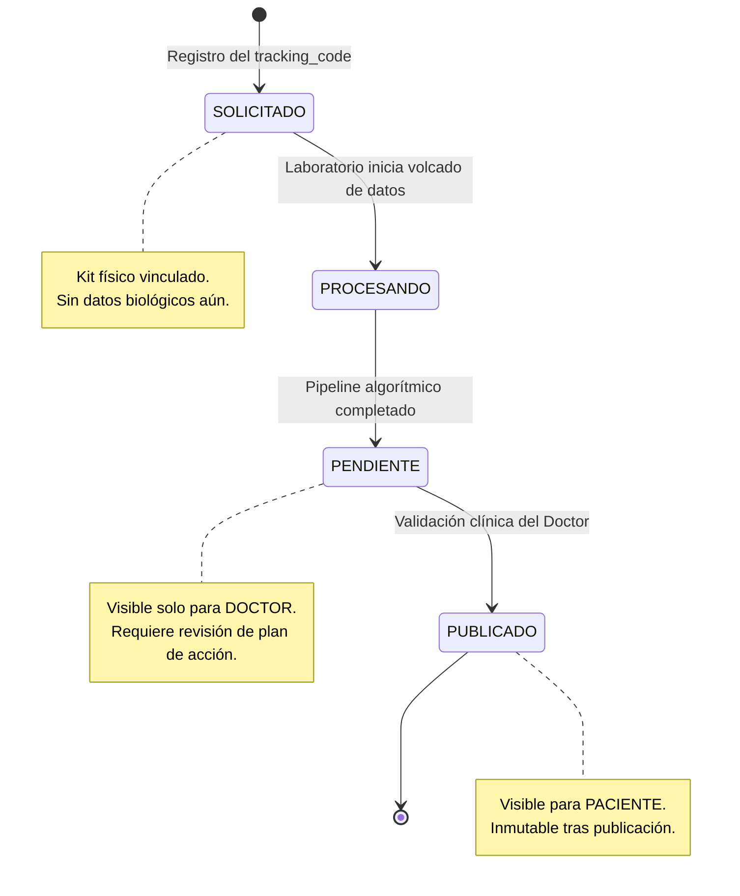
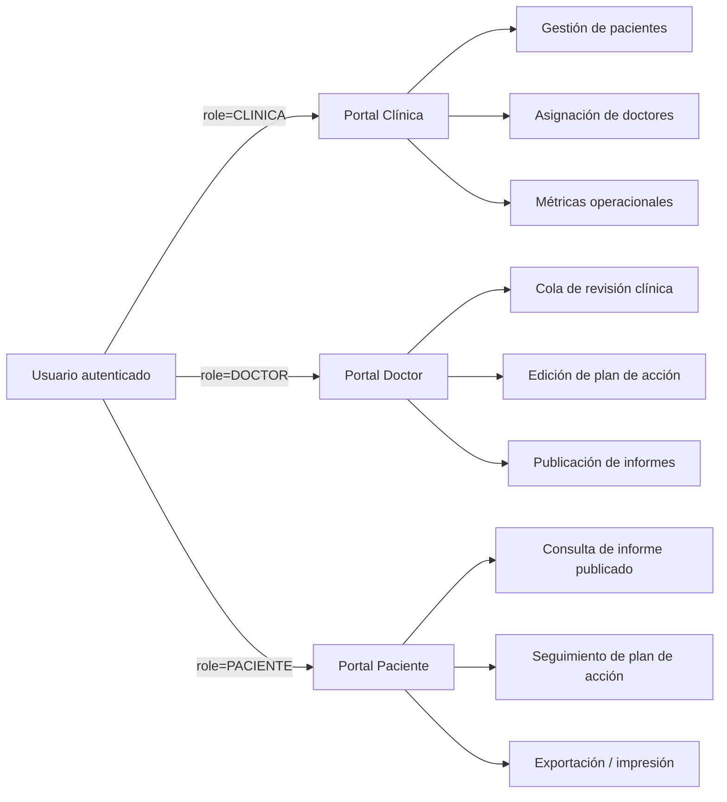
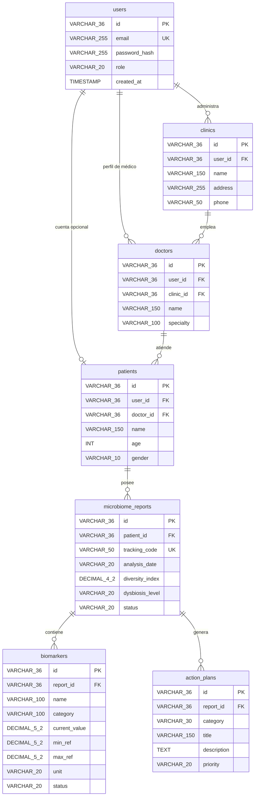

<h1 align="center">🧬 Gestor de Informes Clínicos</h1>
<p align="center">Plataforma Full-Stack para el procesamiento, análisis y visualización de informes de microbioma y biomarcadores</p>

<p align="center">
  
  
  
  
  
  
  
</p>

---

## 📘 Visión General del Sistema

El **Gestor de Informes Clínicos** es una plataforma diseñada para convertir datos biomédicos crudos (análisis de microbiota, biomarcadores, paneles funcionales) en informes clínicos accionables, trazables y auditables.

El sistema resuelve tres problemas centrales del dominio HealthTech:

1. **Trazabilidad física-digital**: cada muestra biológica se vincula de forma unívoca a su informe digital mediante un `tracking_code`, eliminando ambigüedad entre kit físico y resultado.
2. **Gobernanza del ciclo de vida clínico**: ningún informe llega al paciente sin pasar por un flujo de validación algorítmica y revisión médica explícita.
3. **Aislamiento de responsabilidades por rol**: Clínica, Doctor y Paciente operan sobre superficies de datos y acciones completamente distintas, reduciendo superficie de error y de fuga de información sensible.

La arquitectura está diseñada para ser **extensible a otros dominios de análisis clínico** (genética, metabolómica, hematología) sin reescribir el núcleo del sistema.

---

## 🏗️ Arquitectura del Repositorio

Monorepo con dos proyectos independientes y ciclos de despliegue desacoplados:

```bash
gestor-informes-clinicos/
│
├── frontend/                # Dashboard clínico — Next.js 16 (App Router)
│   ├── app/                 # Rutas y portales por rol
│   ├── components/          # Componentes UI y de dominio clínico
│   ├── lib/                 # Cliente API, utilidades
│   ├── types/                # Contratos TypeScript estrictos
│   └── README.md
│
├── backend/                 # API REST — Kotlin + Spring Boot
│   ├── src/main/kotlin/      # Controller → Service → Repository → Domain
│   ├── src/main/resources/   # Configuración, changelogs Liquibase
│   └── README.md
│
└── README.md                 # Documentación global (este archivo)
```

**Contrato de integración:** el frontend consume el backend exclusivamente vía REST/JSON, autenticado con `Authorization: Bearer <JWT>` y versionado mediante la cabecera `X-API-VERSION: 1`.

---

## 🔐 Reglas de Negocio

### Ciclo de vida del informe

Cada `microbiome_report` atraviesa un flujo de estados **estrictamente secuencial y no reversible**, controlado por el backend:



| Estado | Descripción | Visible para |
|---|---|---|
| `SOLICITADO` | Kit registrado, a la espera del laboratorio | Clínica, Doctor |
| `PROCESANDO` | Datos brutos en pipeline de análisis | Clínica, Doctor |
| `PENDIENTE` | Análisis completado, pendiente de validación médica | Doctor |
| `PUBLICADO` | Validado y disponible para el paciente | Paciente, Doctor, Clínica |

### Separación de portales por rol



Cada portal es una superficie de UI y de API independiente: no existen condicionales de rol dispersos en componentes compartidos, sino vistas dedicadas por rol (`PatientView`, `DoctorView`, `ClinicView`) respaldadas por autorización RBAC en el backend.

---

## 🧬 Modelo de Datos



### Relaciones (Foreign Keys)

| Tabla Origen | Columna FK | Tabla Referenciada | Constraint | Cardinalidad | Nulabilidad |
|---|---|---|---|---|---|
| `clinics` | `user_id` | `users(id)` | `fk_clinics_users` | N:1 | `NOT NULL` |
| `doctors` | `user_id` | `users(id)` | `fk_doctors_users` | N:1 | `NOT NULL` |
| `doctors` | `clinic_id` | `clinics(id)` | `fk_doctors_clinics` | N:1 | `NOT NULL` |
| `patients` | `user_id` | `users(id)` | `fk_patients_users` | 1:1 opcional | `NULLABLE` |
| `patients` | `doctor_id` | `doctors(id)` | `fk_patients_doctors` | N:1 | `NULLABLE` |
| `microbiome_reports` | `patient_id` | `patients(id)` | `fk_reports_patients` | N:1 | `NOT NULL` |
| `biomarkers` | `report_id` | `microbiome_reports(id)` | `fk_biomarkers_reports` | N:1 | `NOT NULL` |
| `action_plans` | `report_id` | `microbiome_reports(id)` | `fk_action_plans_reports` | N:1 | `NOT NULL` |

> `patients.doctor_id = NULL` representa un paciente sin doctor asignado (cliente libre gestionado directamente por la clínica).
